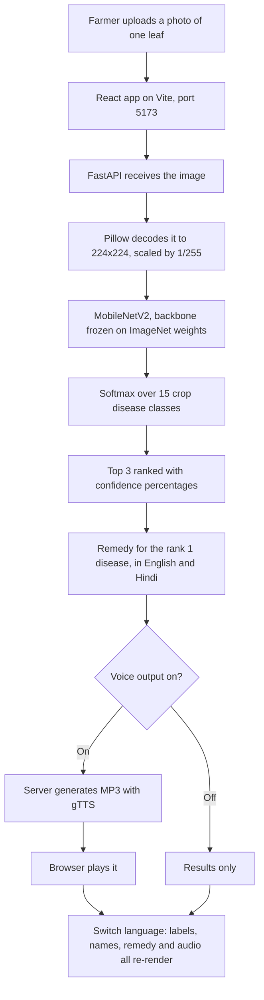

<div align="center">


[](https://react.dev)
[](https://vitejs.dev)
[](https://fastapi.tiangolo.com)
[](https://tensorflow.org)
[](https://keras.io)
[](https://getbootstrap.com)
[](#why-krishva)

**Krishva takes a photo of one leaf, names the disease, tells the farmer how sure it is, and reads the remedy out loud in Hindi or English.**

The name is the idea: **Krish** (कृषि) is farming, **Nova** (नव) is new, and together they make **New Farming**.

**[How it works](#how-it-works)** · **[Features](#features)** · **[Tech stack](#tech-stack)** · **[How to run it](#how-to-run-it)** · **[Training from scratch](#training-from-scratch)**

</div>

---

## Why Krishva

A farmer who spots brown patches on a tomato leaf has three questions, in this order: *what is this, how sure are you, and what do I spray today?* Most apps answer only the first, and answer it in English.

Krishva answers all three. It shows its top three guesses with confidence percentages instead of one confident-sounding answer, gives the remedy for the most likely disease, and speaks it aloud. Switch to Hindi and the whole interface, the disease name, the remedy, and the audio all switch with it, because a farmer who cannot read the remedy in the language the app is showing is not much better off than one who cannot read it at all.

The audience shaped the design more than the model did. English and Hindi are both first-class, voice output is a core feature rather than an add-on, and a low confidence warning tells the farmer to retake the photo instead of presenting a guess as fact.

---

## How it works



The whole round trip happens in one response. Both languages come back together, so switching between English and Hindi re-renders the screen and re-speaks the answer instantly without uploading the photo a second time.

---

## Features

**Prediction**
- 15 disease classes across tomato, pepper bell and potato, each with a healthy counterpart
- Top 3 results with confidence percentages, ranked, not just a single label
- A confidence bar chart in the terminal version
- A low confidence warning suggesting a clearer photo when the model is unsure

**Bilingual by default**
- Every disease name and remedy exists in both English and Hindi
- The language toggle switches the entire interface, including labels, warnings and buttons
- One JSON file feeds the API, the CLI and the web app, so the two languages cannot drift apart

**Voice**
- Spoken results in both languages, generated by the server as real audio files
- Works for low-literacy users, and needs no browser speech support
- A Test voice button, so audio can be checked before a photo is even picked

**Interfaces**
- React web app, responsive, with an image preview
- A command line version that predicts, speaks, and opens the confidence chart
- Interactive API docs at `/docs` with an upload box

**Robustness**
- Uploads are checked for type and size before any processing
- 10 MB upload limit and a 1200 character cap on text-to-speech
- The model and data load once at startup, so requests are served from a warm model

---

## Tech stack

| Layer | Technology | Why |
|---|---|---|
| Model | **MobileNetV2** (Keras 3, TensorFlow 2.20) | 2.4M parameters and about 0.6s CPU inference, small enough to run on a phone |
| Method | **Transfer learning**, backbone frozen | 20K images is far too few to train a CNN from scratch |
| Data | Keras `ImageDataGenerator` with augmentation | the label comes free from the folder name |
| Imbalance | `compute_class_weight('balanced')` | classes range from 236 to 2,567 images, about 11× |
| Serving | **FastAPI** + Uvicorn | async, validated, and interactive docs at `/docs` |
| Frontend | **React 18** + **Vite 8** + Bootstrap 5 | component structure, hot reload, no CDN dependency |
| Voice | **gTTS** for MP3, macOS `say` as the offline fallback | server generated audio plays everywhere a browser plays audio |

### Model architecture

```
Input (None, 224, 224, 3)
  → MobileNetV2  include_top=False, weights=imagenet, FROZEN  → (None, 7, 7, 1280)
  → GlobalAveragePooling2D                                    → (None, 1280)
  → Dense(128, activation='relu')                              → (None, 128)
  → Dropout(0.3)
  → Dense(15, activation='softmax')                            → (None, 15)

Total params     2,423,887
Trainable params   165,903   (6.8%, the rest stays frozen)
```

`GlobalAveragePooling2D` instead of `Flatten` takes the first Dense layer from roughly 8M parameters down to 164K, which is what makes a model this size workable on a 20K image dataset.

---

## How to run it

The trained model is committed, so there is nothing to train first.

**1. Backend**

```bash
git clone https://github.com/Ishika1106/Krishva.git
cd Krishva
python3 -m venv venv
source venv/bin/activate          # Windows: venv\Scripts\activate
pip install -r requirements.txt

uvicorn main:app --reload --port 8000
```

**2. Frontend**

```bash
cd frontend
npm install
npm run dev
```

**3. Open it**

Go to **http://localhost:5173** and upload a leaf. The API is at **http://127.0.0.1:8000**, and **http://127.0.0.1:8000/docs** gives you a Swagger UI with an upload box you can test against directly.

Turn Voice output on and press **Test voice** before uploading anything. If you hear the sample, audio is working.

**Command line**

```bash
python predict.py                  # Hindi voice
python predict.py leaf.jpg         # your own image
python predict.py leaf.jpg --lang en
```

It prints the top three, the remedy in both languages, and opens the confidence chart.

---

## Training from scratch

Only needed if you want to retrain. The `dataset/` folder is not in the repo, it is 370 MB of images.

**The folder name is the label.** `flow_from_directory` reads it directly, so the structure has to be:

```
dataset/
├── Pepper_bell_bacterial_spot/    *.JPG
├── Pepper_bell_healthy/           *.JPG
├── Potato_early_blight/           *.JPG
├── ...
└── Tomato_tomato_yellowleaf_curl_virus/   *.JPG
```

20,764 images across 15 classes.

```bash
python check_corrupted.py     # verify no broken images
python move_duplicates.py     # move byte-identical duplicates out
python train_model.py         # ~1-3 hours on a laptop CPU
```

`train_model.py` writes `class_names.json` from `train_gen.class_indices`, so the index-to-name mapping is generated by the same code that built the labels and the two cannot disagree.

---

## Project layout

```
Krishva/
├── main.py                 FastAPI backend: /api/predict and /api/speak
├── predict.py              CLI: predict, speak, open the chart
├── train_model.py          MobileNetV2 with a frozen backbone
├── frontend/
│   ├── src/App.jsx         Main app: upload, results, language and voice
│   ├── src/components/     ResultTable, SegmentedToggle, VoicePicker
│   ├── src/lib/            api.js, i18n.js, useSpeech.js
│   └── src/styles.css
├── disease_info.json       All 15 classes: English + Hindi name and remedy
├── crop_disease_model.h5   Trained model (11 MB, committed)
├── class_names.json        Class name ↔ index mapping
├── requirements.txt        Pinned Python dependencies
├── check_corrupted.py      Dataset integrity scanner
├── move_duplicates.py      MD5 exact-duplicate remover
├── voices.py               Lists the TTS voices installed on this machine
├── test.JPG                Sample leaf image
└── LICENSE
```

---

## Design decisions

**Transfer learning.** MobileNetV2 comes pretrained on 1.28M ImageNet images. Setting `base_model.trainable = False` freezes its 2,257,984 weights so the optimizer only learns our 166K head. Training from scratch on 20K images would overfit badly.

**Class imbalance.** `Potato_healthy` has 236 images, `Tomato_yellow_leaf_curl_virus` has 2,567. Balanced class weights push the rare classes about 11× harder than the common ones, so the model cannot simply learn to predict the majority classes.

**Two data generators.** Augmentation is applied to training only. A single shared `ImageDataGenerator` would rotate and flip the validation images too, which makes `val_loss` meaningless and breaks `EarlyStopping`. This was verified before the split.

**Preprocessing has to match exactly.** `rescale=1./255` and `target_size=(224,224)` appear identically in `train_model.py`, `main.py` and `predict.py`. A mismatch does not raise an error, it just quietly destroys accuracy.

**All disease text in one file.** `disease_info.json` holds the English and Hindi name and remedy for every class, plus the interface strings, and `main.py` and `predict.py` both read from it. The original project kept two separate inline Python dictionaries and had already lost a class from both.

**Voice comes from the server.** The browser's own `speechSynthesis` was tried first and dropped. On Chrome it reports 180 available voices, fires `onstart` and `onend`, and raises no error while producing no sound at all, so there is nothing to catch and nowhere to fall back from. The server generates a real audio file instead, which plays everywhere. A macOS `say` fallback keeps voice working if the internet drops.

**Remedies are practical, not generic.** Each one names what to remove, what to spray, and what to change about watering, in language a farmer would actually use.

---

## Possible next steps

1. Confusion matrix with a per-class precision, recall and F1 report
2. Fine tune the last MobileNetV2 block at a much lower learning rate
3. Convert to TFLite for offline on-device inference
4. Group the train and validation split by leaf to remove near-duplicate leakage
5. Convert the model to ONNX and run it in the browser with a Python microservice for training only

---

## Credits

Dataset: [PlantVillage](https://plantvillage.psu.edu/), by Hughes and Salathé. Please cite the original authors if you build on it.

Backbone: MobileNetV2, Howard et al.

---

## License

MIT. See [LICENSE](LICENSE).

---

<div align="center">


*Krishva — for the ones still growing.*

</div>
